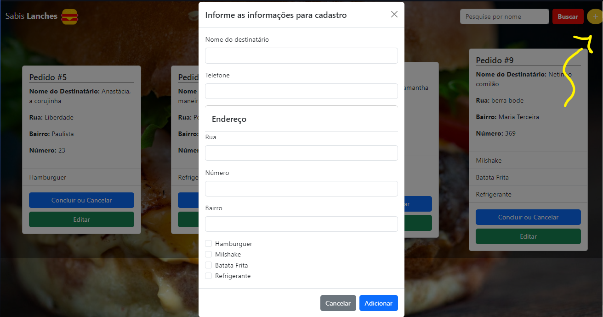
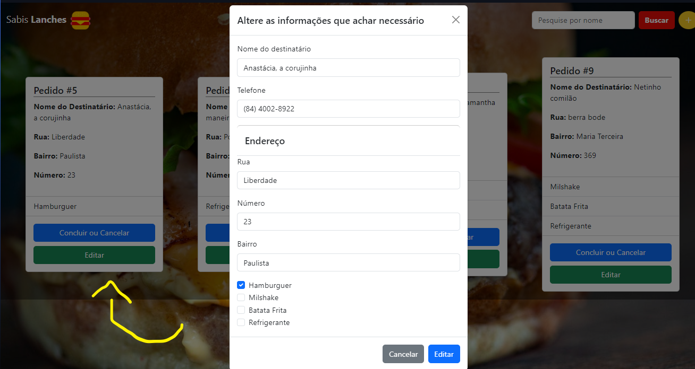
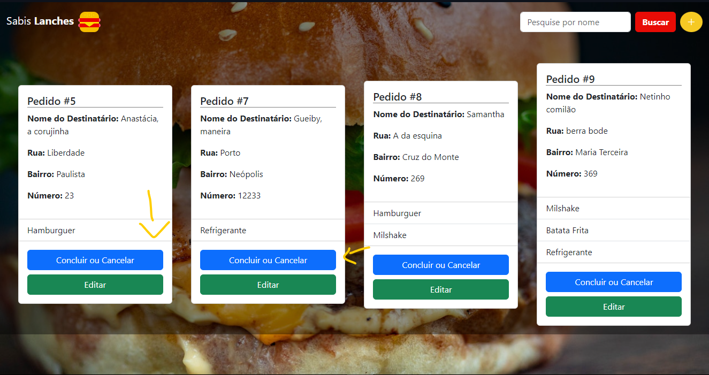

# CRUD para Controle de Pedidos de uma Lanchonete Delivery

Contando com diversas tecnologias, o **SabisLanches** é uma ferramenta para registrar pedidos de uma lanchonete delivery. O site possui separação de usuários, ou seja, cada usuário possui seus pedidos

# Tecnologias Utilizadas

O **sabisLanche** foi desenvolvido utilizando uma combinação de tecnologias para oferecer uma experiência eficiente e funcional. Aqui estão as principais tecnologias utilizadas:

1. **JavaScript, HTML e CSS:**

   - Linguagens fundamentais para o desenvolvimento web, proporcionando a estrutura, o estilo e a interatividade do site.

2. **Bootstrap:**

   - Framework front-end que agiliza o desenvolvimento com componentes predefinidos e estilos responsivos, garantindo um layout visualmente atraente.

3. **Express:**

   - Framework Node.js para construção de APIs robustas, simplificando o roteamento e gerenciamento de requisições HTTP.

4. **Nodemon:**

   - Ferramenta de desenvolvimento que monitora alterações nos arquivos e reinicia automaticamente o servidor, facilitando o processo de desenvolvimento.

5. **Prisma:**

   - ORM (Object-Relational Mapping) para TypeScript e JavaScript, utilizado para facilitar a interação com o banco de dados Postgres e simplificar operações de CRUD.

6. **JsonWebToken (JWT):**
   - Biblioteca para geração e verificação de tokens de autenticação, proporcionando segurança e controle de acesso ao sistema.

Essas tecnologias foram escolhidas para proporcionar uma base sólida, eficiente e moderna para o desenvolvimento do **sabisLanche**, garantindo uma experiência de usuário fluida e uma arquitetura robusta nos bastidores.

## Como Fazer o Site Funcionar

1. **Baixe o Repositório:**

   - Faça o download ou clone este repositório em sua máquina local.

2. **Entre na Pasta do Projeto:**

   - Navegue até o diretório do projeto usando o terminal ou prompt de comando.

3. **Instale as Dependências:**

   - Execute o seguinte comando para instalar as dependências necessárias:
     ```bash
     npm install
     ```

4. **Inicie o Servidor de Desenvolvimento:**

   - Após a conclusão da instalação, inicie o servidor de desenvolvimento com o seguinte comando:
     ```bash
     npm run dev
     ```

5. **Aguarde a Confirmação de que a API Está Rodando:**

   - Assim que a API estiver rodando, você receberá uma mensagem no terminal indicando que está pronta para ser usada.

6. **Pronto:**
   - O site agora está funcionando localmente. Abra o navegador e acesse o endereço indicado pelo servidor de desenvolvimento para interagir com o site.

## Funcionalidades

### Página como um Todo

O site conta com um visual temático de fast foods e é fácil de usar.


### Cadastro de Dados

Ao clicar no botão redondo, amarelo e com símbolo de adição, o usuário é apresentado ao modal de cadastro de pedidos, onde preencherá seu nome, telefone, endereço e os produtos desejados.


### Edição dos Pedidos Já Registrados

Ao clicar no botão verde dentro do card do pedido, o usuário é apresentado a um formulário semelhante ao usado para o cadastro, mas já preenchido com as informações do pedido registrado, aguardando apenas a confirmação de alterações.


### Concluir/Deletar Pedido

Para concluir ou deletar um pedido, basta clicar no botão azul dentro do card do pedido, que o pedido será removido da página e do registro na API.

